# Diagrama Entidad-Relación — Sistema de Gestión HSE
**Versión del Schema:** 3.0 (Marzo 2026)  
**Motor:** PostgreSQL 16 — ORM: Prisma v7  
**Última actualización:** 2026-03-07 — Auditoría: `HSE-db-expert`

---

## 1. Diagrama E-R-E (Mermaid)

> Renderiza este diagrama en cualquier visor compatible con Mermaid (GitHub, VSCode con extensión, etc.)

```mermaid
erDiagram
    %% ══════════════════════════════════════════════════════════════
    %% MÓDULO 0 — ACCESO Y SEGURIDAD
    %% ══════════════════════════════════════════════════════════════

    Usuario {
        uuid    id                PK
        string  correo            UK
        string  contrasena
        string  nombreCompleto
        enum    rol
        boolean activo
        datetime deletedAt        "Soft-Delete"
        datetime creadoEn
        datetime actualizadoEn
    }

    Supervisor {
        uuid    id           PK
        uuid    usuarioId    FK,UK
        string  telefono
        datetime creadoEn
        datetime actualizadoEn
    }

    SupervisorSucursal {
        uuid    id           PK
        uuid    supervisorId FK
        uuid    sucursalId   FK
    }

    RegistroAuditoria {
        uuid    id        PK
        uuid    usuarioId FK
        string  accion
        string  entidad
        string  entidadId
        json    detalles   "JSONB: datos del cambio"
        string  ip
        datetime creadoEn
    }

    Notificacion {
        uuid    id              PK
        uuid    destinatarioId  FK
        string  tipo
        string  titulo
        string  mensaje
        boolean leida
        boolean enviadaPorEmail
        datetime creadoEn
    }

    %% ══════════════════════════════════════════════════════════════
    %% MÓDULO 1 — BASE MAESTRA
    %% ══════════════════════════════════════════════════════════════

    Sucursal {
        uuid    id                            PK
        string  nombre                        UK
        string  direccion
        float   latitud
        float   longitud
        boolean activa
        enum    tipoInstalacion
        enum    nivelRiesgo
        enum    categoriaIncendio
        string  codigoCIIU
        string  codigoEstablecimientoINDECI   UK
        datetime vencimientoCertificadoDC
        int     aforoMaximo
        float   areaM2
        int     numeroPisos
        json    brigadasEmergencia            "JSONB: brigadas y roles"
        json    peligrosIdentificados         "JSONB: peligros por zona"
        enum    resultadoUltimaInspeccion
        datetime deletedAt                    "Soft-Delete"
        datetime creadoEn
        datetime actualizadoEn
    }

    Trabajador {
        uuid    id                    PK
        string  dni                   UK
        string  nombreCompleto
        string  cargo
        uuid    sucursalId            FK
        enum    estadoEMO
        datetime fechaVencimientoEMO
        enum    estadoLaboral
        string  tipoSangre
        string  codigoQr              UK
        string  fotoUrl
        string  alergiasCriticas
        string  condicionesPreexistentes
        string  eps
        string  arl
        boolean activo
        datetime deletedAt            "Soft-Delete"
        datetime creadoEn
        datetime actualizadoEn
    }

    %% ══════════════════════════════════════════════════════════════
    %% MÓDULO 2 — EXPEDIENTE 360° DEL TRABAJADOR
    %% ══════════════════════════════════════════════════════════════

    ExamenMedico {
        uuid    id                  PK
        uuid    trabajadorId        FK
        enum    tipoExamen
        datetime fechaExamen
        enum    estado
        string  restricciones
        string  medicoEvaluador
        string  institucion
        string  documentoUrl
        datetime proximoVencimiento
        datetime creadoEn
    }

    EntregaEpp {
        uuid    id              PK
        uuid    trabajadorId    FK
        string  tipoEpp
        string  marca
        string  talla
        datetime fechaEntrega
        datetime fechaVencimiento
        datetime creadoEn
    }

    Capacitacion {
        uuid    id              PK
        uuid    trabajadorId    FK
        string  nombreCurso
        string  institucion
        datetime fechaRealizacion
        datetime fechaVencimiento
        string  certificadoUrl
        boolean vigente
        datetime creadoEn
    }

    MatrizIpc {
        uuid    id                       PK
        string  cargo
        string  ubicacion
        json    eppsObligatorios          "JSONB + GIN index"
        json    herramientasRequeridas    "JSONB + GIN index"
        json    capacitacionesRequeridas  "JSONB + GIN index"
        string  descripcion
        boolean activo
        datetime creadoEn
        datetime actualizadoEn
    }

    %% ══════════════════════════════════════════════════════════════
    %% MÓDULO 3 — GESTIÓN DE EQUIPOS
    %% ══════════════════════════════════════════════════════════════

    Equipo {
        uuid    id                       PK
        string  nombre
        string  numeroSerie              UK
        string  nfcTagId                 UK
        enum    estado
        uuid    sucursalId               FK
        string  ubicacionFisica
        enum    tipoEquipo
        datetime fechaAdquisicion
        int     vidaUtilMeses
        datetime proximoMantenimiento
        float   horasOperadasActuales
        boolean requiereLoto
        string  puntosBloqueo
        string[] energiasPeligrosas
        json    eppObligatorio            "JSONB: EPP por máquina"
        datetime deletedAt               "Soft-Delete"
        datetime creadoEn
        datetime actualizadoEn
    }

    Calibracion {
        uuid    id                   PK
        uuid    equipoId             FK
        datetime fechaCalibracion
        datetime proximaCalibracion
        string  entidadCertificadora
        string  numeroCertificado
        enum    estadoResultado
        string  certificadoUrl
        datetime creadoEn
    }

    Mantenimiento {
        uuid    id                   PK
        uuid    equipoId             FK
        enum    tipoMantenimiento
        datetime fechaMantenimiento
        datetime proximoMantenimiento
        string  tecnicoResponsable
        string  proveedorServicio
        string  trabajoRealizado
        float   horasEquipoAlMomento
        float   costoSoles
        boolean equipoFueraServicio
        string  certificadoUrl
        datetime creadoEn
    }

    AutorizacionOperador {
        uuid    id                      PK
        uuid    trabajadorId            FK
        uuid    equipoId                FK
        string  capacitacionRequerida
        boolean capacitacionVerificada
        boolean emoVigenteVerificado
        boolean eppVerificado
        enum    estado
        datetime fechaVencimiento
        string  autorizadoPorId
        datetime creadoEn
        datetime actualizadoEn
    }

    EjecucionLoto {
        uuid    id               PK
        uuid    equipoId         FK
        uuid    trabajadorId     FK
        string  motivoBloqueo
        string  autorizadoPorId
        datetime fechaBloqueo
        datetime fechaDesbloqueo
        json    listaVerificacion  "JSONB: checklist energía cero"
        enum    estadoEjecucion
        datetime creadoEn
        datetime actualizadoEn
    }

    %% ══════════════════════════════════════════════════════════════
    %% MÓDULO 4 — INSPECCIONES
    %% ══════════════════════════════════════════════════════════════

    Inspeccion {
        uuid    id               PK
        uuid    supervisorId     FK
        uuid    sucursalId       FK
        uuid    equipoId         FK "nullable"
        string  ubicacion
        string  tipoTrabajo
        enum    estado
        enum    tipoInspeccion
        json    checklist          "JSONB: ítems dinámicos"
        string  observaciones
        boolean firmaSupervisor
        string  firmaBase64
        float   latitudCierre
        float   longitudCierre
        datetime fechaCierre
        datetime deletedAt       "Soft-Delete"
        datetime creadoEn
        datetime actualizadoEn
    }

    InspeccionTrabajador {
        uuid    id           PK
        uuid    inspeccionId FK
        uuid    trabajadorId FK
    }

    FotoInspeccion {
        uuid    id           PK
        uuid    inspeccionId FK
        string  rutaArchivo
        string  descripcion
        json    metadatos     "JSONB: timestamp, dispositivo"
        datetime fechaCaptura
    }

    %% ══════════════════════════════════════════════════════════════
    %% MÓDULO 5 — AMONESTACIONES E INCIDENTES
    %% ══════════════════════════════════════════════════════════════

    Amonestacion {
        uuid    id           PK
        uuid    trabajadorId FK
        uuid    supervisorId FK
        uuid    sucursalId   FK
        string  motivo
        enum    severidad
        string  descripcion
        string  testimonios
        datetime fechaEvento
        datetime deletedAt   "Soft-Delete"
        datetime creadoEn
        datetime actualizadoEn
    }

    FotoAmonestacion {
        uuid    id             PK
        uuid    amonestacionId FK
        string  rutaArchivo
        string  descripcion
        datetime fechaCaptura
    }

    Incidente {
        uuid    id             PK
        uuid    trabajadorId   FK
        uuid    amonestacionId FK "nullable"
        string  descripcion
        string  ubicacion
        datetime fechaEvento
        datetime deletedAt     "Soft-Delete"
        datetime creadoEn
    }

    %% ══════════════════════════════════════════════════════════════
    %% RELACIONES
    %% ══════════════════════════════════════════════════════════════

    %% — Acceso y Seguridad
    Usuario          ||--o|  Supervisor          : "extiende (1:1)"
    Usuario          ||--o{  RegistroAuditoria   : "genera"
    Usuario          ||--o{  Notificacion        : "recibe"

    %% — Asignación Supervisor ↔ Sucursal (M:M)
    Supervisor       ||--o{  SupervisorSucursal  : "asignado a"
    Sucursal         ||--o{  SupervisorSucursal  : "tiene"

    %% — Supervisor como actor operativo
    Supervisor       ||--o{  Inspeccion          : "conduce"
    Supervisor       ||--o{  Amonestacion        : "emite"

    %% — Sucursal como contenedor
    Sucursal         ||--o{  Trabajador          : "alberga"
    Sucursal         ||--o{  Inspeccion          : "es sede de"
    Sucursal         ||--o{  Amonestacion        : "registra"
    Sucursal         ||--o{  Equipo              : "alberga"

    %% — Expediente 360° del Trabajador
    Trabajador       ||--o{  ExamenMedico        : "tiene historial"
    Trabajador       ||--o{  EntregaEpp          : "recibe"
    Trabajador       ||--o{  Capacitacion        : "posee"
    Trabajador       ||--o{  Amonestacion        : "recibe"
    Trabajador       ||--o{  Incidente           : "protagoniza"
    Trabajador       ||--o{  InspeccionTrabajador: "participa en"
    Trabajador       ||--o{  AutorizacionOperador: "tiene"
    Trabajador       ||--o{  EjecucionLoto       : "ejecuta"

    %% — Ciclo de vida del Equipo
    Equipo           ||--o{  Calibracion         : "tiene"
    Equipo           ||--o{  Mantenimiento       : "tiene"
    Equipo           ||--o{  AutorizacionOperador: "requiere"
    Equipo           ||--o{  EjecucionLoto       : "requiere"
    Equipo           ||--o{  Inspeccion          : "es inspeccionado en"

    %% — Inspecciones
    Inspeccion       ||--o{  InspeccionTrabajador: "incluye"
    Inspeccion       ||--o{  FotoInspeccion      : "documenta con"

    %% — Amonestaciones
    Amonestacion     ||--o{  FotoAmonestacion    : "documenta con"
    Amonestacion     ||--o|  Incidente           : "puede originar"
```

---

## 2. Inventario de Entidades

### Módulo 0 — Acceso y Seguridad del Sistema

| Entidad | Tabla SQL | Propósito |
|---|---|---|
| `Usuario` | `usuarios` | Cuenta de acceso al sistema. Rol RBAC: `COORDINADOR`, `SUPERVISOR`, `JEFATURA`. Soft-Delete para trazabilidad SUNAFIL. |
| `Supervisor` | `supervisores` | Extensión de `Usuario` (1:1). Agrega el campo `telefono` y las relaciones operativas (inspecciones, amonestaciones, sucursales). |
| `SupervisorSucursal` | `supervisor_sucursal` | Tabla pivot M:M. Un supervisor puede cubrir múltiples sedes y una sede puede tener múltiples supervisores. |
| `RegistroAuditoria` | `registros_auditoria` | Audit trail inmutable (PRD §5 — Trazabilidad Absoluta). Almacena cada acción del usuario, entidad afectada y payload de cambio en JSONB. |
| `Notificacion` | `notificaciones` | Alertas internas (vencimientos, faltas críticas). Destinatario = `Usuario`. |

---

### Módulo 1 — Base de Datos Maestra

| Entidad | Tabla SQL | Propósito |
|---|---|---|
| `Sucursal` | `sucursales` | Sede/instalación física de la empresa. Contiene 35+ campos legales: clasificación INDECI, certificados DC, brigadas de emergencia, datos SUNAFIL. JSONB para brigadas y peligros. Soft-Delete. |
| `Trabajador` | `trabajadores` | Expediente base del trabajador. Cache del estado EMO actual. Campos de emergencia (tipo de sangre, alergias, EPS) accesibles vía QR. Soft-Delete. |

---

### Módulo 2 — Expediente 360° del Trabajador

| Entidad | Tabla SQL | Propósito |
|---|---|---|
| `ExamenMedico` | `examenes_medicos` | Historial normalizado de EMO. El modelo `Trabajador` solo guarda el cache del último estado; el historial completo vive aquí. `onDelete: Restrict` (prueba legal inmutable). |
| `EntregaEpp` | `entregas_epp` | Registro de cada entrega de EPP (casco, arnés, etc.). `onDelete: Restrict`. |
| `Capacitacion` | `capacitaciones` | Certificaciones y cursos del trabajador. `onDelete: Restrict`. |
| `MatrizIpc` | `matriz_ipc` | Tabla **independiente** (sin FK). Define los EPPs, herramientas y capacitaciones obligatorias por `cargo + ubicación`. JSONB con índices GIN para búsquedas sub-milisegundo. |

---

### Módulo 3 — Gestión de Equipos y Maquinaria

| Entidad | Tabla SQL | Propósito |
|---|---|---|
| `Equipo` | `equipos` | Maquinaria y herramientas. NFC Tag para identificación. Clasificación legal `TipoEquipo`. Protocolo LOTO integrado (`requiereLoto`, `puntosBloqueo`, `energiasPeligrosas`). Soft-Delete. |
| `Calibracion` | `calibraciones` | Historial de calibraciones metrológicas (INACAL / NTP-ISO/IEC 17025). `onDelete: Restrict`. |
| `Mantenimiento` | `mantenimientos` | Intervenciones técnicas (preventivo, correctivo, overhaul). Trazabilidad de repuestos y costos. `onDelete: Restrict`. |
| `AutorizacionOperador` | `autorizaciones_operador` | Tabla intermedia M:M con lógica de negocio. Autoriza a un `Trabajador` a operar un `Equipo`. Requiere verificación de capacitación, EMO y EPP antes de cambiar estado a `AUTORIZADO`. Restricción única: un trabajador solo puede tener una autorización activa por equipo. |
| `EjecucionLoto` | `ejecuciones_loto` | Registro de procedimientos LOTO (Lockout/Tagout — OSHA 1910.147). Obligatorio antes de mantenimiento en equipos con `requiereLoto = true`. Checklist en JSONB. |

---

### Módulo 4 — Inspecciones

| Entidad | Tabla SQL | Propósito |
|---|---|---|
| `Inspeccion` | `inspecciones` | Acta de inspección SST. Puede ser GENERAL o vinculada a un `Equipo` (PRE_USO, PERIODICA, POST_INCIDENTE). Checklist dinámico en JSONB generado desde la `MatrizIpc`. Firma digital base64. Soft-Delete. |
| `InspeccionTrabajador` | `inspeccion_trabajador` | Tabla pivot M:M. Registra qué trabajadores participaron en cada inspección. |
| `FotoInspeccion` | `fotos_inspeccion` | Evidencia fotográfica de la inspección. Metadatos (timestamp, dispositivo) en JSONB. `onDelete: Cascade`. |

---

### Módulo 5 — Amonestaciones e Incidentes

| Entidad | Tabla SQL | Propósito |
|---|---|---|
| `Amonestacion` | `amonestaciones` | Sanción disciplinaria con valor jurídico. Vincula `Trabajador`, `Supervisor` y `Sucursal`. Severidad: LEVE / GRAVE / CRÍTICA. Soft-Delete. |
| `FotoAmonestacion` | `fotos_amonestacion` | Evidencia fotográfica de la amonestación. `onDelete: Cascade`. |
| `Incidente` | `incidentes` | Reporte de accidente/incidente (Art. 82 Ley 29783). Puede originarse de una `Amonestacion` (FK nullable). Soft-Delete. |

---

## 3. Cardinalidades y Relaciones

| Relación | Cardinalidad | Política `onDelete` | Notas |
|---|---|---|---|
| `Usuario` → `Supervisor` | 1:1 | `Cascade` | Si se elimina el usuario, se elimina el supervisor |
| `Usuario` → `RegistroAuditoria` | 1:N | `Restrict` | Audit trail inmutable — no se puede eliminar un usuario con registros |
| `Usuario` → `Notificacion` | 1:N | `Cascade` | Las notificaciones siguen el ciclo de vida del usuario |
| `Supervisor` ↔ `Sucursal` | M:M via `SupervisorSucursal` | `Cascade` en ambos lados | La tabla pivot se limpia al eliminar cualquiera de los dos |
| `Sucursal` → `Trabajador` | 1:N | `Restrict` | No se puede eliminar una sede con trabajadores activos |
| `Sucursal` → `Equipo` | 1:N | `Restrict` | No se puede eliminar una sede con equipos activos |
| `Sucursal` → `Inspeccion` | 1:N | `Restrict` | Historial de inspecciones preservado |
| `Sucursal` → `Amonestacion` | 1:N | `Restrict` | Evidencia legal preservada |
| `Trabajador` → `ExamenMedico` | 1:N | `Restrict` | Historial médico inmutable |
| `Trabajador` → `EntregaEpp` | 1:N | `Restrict` | Expediente EPP inmutable |
| `Trabajador` → `Capacitacion` | 1:N | `Restrict` | Certificaciones inmutables |
| `Trabajador` → `Amonestacion` | 1:N | `Restrict` | Sanción con valor jurídico |
| `Trabajador` → `Incidente` | 1:N | `Restrict` | Reporte legal inmutable |
| `Trabajador` ↔ `Inspeccion` | M:M via `InspeccionTrabajador` | `Cascade`/`Restrict` | Cascade en inspección, Restrict en trabajador |
| `Trabajador` ↔ `Equipo` | M:M via `AutorizacionOperador` | `Restrict` en ambos | Un trabajador necesita autorización válida por equipo |
| `Trabajador` → `EjecucionLoto` | 1:N | `Restrict` | Registro de seguridad inmutable |
| `Equipo` → `Calibracion` | 1:N | `Restrict` | Historial de calibración inmutable |
| `Equipo` → `Mantenimiento` | 1:N | `Restrict` | Historial de mantenimiento inmutable |
| `Equipo` → `EjecucionLoto` | 1:N | `Restrict` | Registro LOTO inmutable |
| `Equipo` → `Inspeccion` | 1:N | `SetNull` | Si el equipo se desvincula, la inspección permanece |
| `Inspeccion` → `FotoInspeccion` | 1:N | `Cascade` | Las fotos siguen el ciclo de la inspección |
| `Inspeccion` → `InspeccionTrabajador` | 1:N | `Cascade` | La pivot se elimina con la inspección |
| `Amonestacion` → `FotoAmonestacion` | 1:N | `Cascade` | Las fotos siguen el ciclo de la amonestación |
| `Amonestacion` → `Incidente` | 1:N | `SetNull` | El incidente puede existir sin amonestación |

---

## 4. ENUMs del Sistema

| Enum | Valores | Usado en |
|---|---|---|
| `Rol` | `COORDINADOR` / `SUPERVISOR` / `JEFATURA` | `usuarios.rol` |
| `EstadoLaboral` | `ACTIVO` / `CESADO` | `trabajadores.estadoLaboral` |
| `EstadoEMO` | `APTO` / `NO_APTO` / `APTO_RESTRICCION` | `trabajadores.estadoEMO`, `examenes_medicos.estado` |
| `TipoExamenMedico` | `INGRESO` / `PERIODICO` / `RETIRO` / `REINTEGRO` | `examenes_medicos.tipoExamen` |
| `EstadoEquipo` | `OPERATIVO` / `EN_MANTENIMIENTO` / `BAJA_TECNICA` | `equipos.estado` |
| `TipoEquipo` | `MAQUINARIA_PESADA` / `HERRAMIENTA_PODER` / `EQUIPO_MEDICION` / `VEHICULO` / `EQUIPO_PRESION` / `HERRAMIENTA_MENOR` | `equipos.tipoEquipo` |
| `EstadoAutorizacion` | `PENDIENTE` / `AUTORIZADO` / `SUSPENDIDO` / `REVOCADO` | `autorizaciones_operador.estado` |
| `TipoMantenimiento` | `PREVENTIVO` / `CORRECTIVO` / `PREDICTIVO` / `OVERHAUL` | `mantenimientos.tipoMantenimiento` |
| `EstadoCalibracion` | `CONFORME` / `NO_CONFORME` / `CONDICIONADO` | `calibraciones.estadoResultado` |
| `EstadoLoto` | `BLOQUEADO` / `DESBLOQUEADO` / `INCIDENCIA` | `ejecuciones_loto.estadoEjecucion` |
| `SeveridadFalta` | `LEVE` / `GRAVE` / `CRITICA` | `amonestaciones.severidad` |
| `EstadoInspeccion` | `EN_PROGRESO` / `COMPLETADA` / `CANCELADA` | `inspecciones.estado` |
| `TipoInspeccion` | `GENERAL` / `PRE_USO` / `PERIODICA` / `POST_INCIDENTE` | `inspecciones.tipoInspeccion` |
| `TipoInstalacion` | `OFICINA` / `PLANTA_INDUSTRIAL` / `ALMACEN` / `LABORATORIO` / `OBRA` | `sucursales.tipoInstalacion` |
| `NivelRiesgo` | `BAJO` / `MEDIO` / `ALTO` / `CRITICO` | `sucursales.nivelRiesgo` |
| `CategoriaIncendio` | `BAJO` / `ORDINARIO` / `ALTO` | `sucursales.categoriaIncendio` |
| `ResultadoInspeccionSUNAFIL` | `CONFORME` / `OBSERVADO` / `NO_CONFORME` / `SANCIONADO` | `sucursales.resultadoUltimaInspeccion` |

---

## 5. Campos JSONB y Estrategia de Indexación

Los campos `JSONB` evitan una explosión de tablas auxiliares para datos semi-estructurados de baja frecuencia de consulta. Los campos JSONB con alta frecuencia de búsqueda tienen índices GIN aplicados vía SQL raw en migración.

| Tabla | Campo JSONB | Estructura Esperada | Índice |
|---|---|---|---|
| `sucursales` | `brigadasEmergencia` | `[{"tipo":"Evacuación","jefe":"Juan Pérez","miembros":4,"certificado":true}]` | Ninguno (baja frecuencia) |
| `sucursales` | `peligrosIdentificados` | `[{"tipo":"Eléctrico","nivel":"ALTO","zona":"Sala servidores","control":"CO2"}]` | Ninguno (baja frecuencia) |
| `equipos` | `eppObligatorio` | `[{"tipo":"CASCO","especificacion":"Clase E","obligatorio":true}]` | Ninguno |
| `inspecciones` | `checklist` | `[{"item":"Uso de arnés","estado":"OK","obs":""}]` | Ninguno |
| `ejecuciones_loto` | `listaVerificacion` | `[{"paso":"Abrir disyuntor A-3","verificado":true}]` | Ninguno |
| `matriz_ipc` | `eppsObligatorios` | `[{"tipo":"CASCO","nivel":"A"}]` | **GIN** — `idx_matriz_epps_gin` |
| `matriz_ipc` | `herramientasRequeridas` | `[{"nombre":"Taladro 18V"}]` | **GIN** — `idx_matriz_herramientas_gin` |
| `matriz_ipc` | `capacitacionesRequeridas` | `[{"nombre":"Trabajo en altura"}]` | **GIN** — `idx_matriz_capacitaciones_gin` |
| `registros_auditoria` | `detalles` | Libre — payload del cambio | Ninguno |
| `fotos_inspeccion` | `metadatos` | `{"timestamp":"...","dispositivo":"..."}` | Ninguno |

---

## 6. Índices Críticos de Rendimiento

| Tabla | Índice / Campo | Propósito |
|---|---|---|
| `usuarios` | `[activo]`, `[deletedAt]` | Filtrar usuarios activos vs. eliminados |
| `sucursales` | `[vencimientoCertificadoDC]` | **Alerta:** certificados DC próximos a vencer |
| `sucursales` | `[resultadoUltimaInspeccion]` | Dashboard: sedes con observaciones SUNAFIL |
| `sucursales` | `[nivelRiesgo]`, `[tipoInstalacion]` | Filtros de riesgo operacional |
| `trabajadores` | `[tipoSangre]` | Emergencias: filtro rápido en escáner QR |
| `trabajadores` | `[estadoLaboral]`, `[activo]`, `[deletedAt]` | Expedientes activos vs. cesados |
| `equipos` | `[proximoMantenimiento]` | Alertas de mantenimiento próximo |
| `equipos` | `[estado]`, `[tipoEquipo]` | Clasificación para auditorías |
| `calibraciones` | `[proximaCalibracion]` | Alertas de vencimiento de calibración |
| `calibraciones` | `[estadoResultado]` | Filtrar equipos con calibración NO_CONFORME |
| `autorizaciones_operador` | `[estado]`, `[fechaVencimiento]` | Alertas de autorización próxima a vencer |
| `examenes_medicos` | `[proximoVencimiento]` | Alertas de EMO próximo a vencer |
| `inspecciones` | `[tipoInspeccion]`, `[equipoId]` | Historial de inspecciones por equipo |
| `amonestaciones` | `[trabajadorId]`, `[severidad]` | Dashboard disciplinario |
| `incidentes` | `[fechaEvento]` | Reporte estadístico de siniestralidad |
| `registros_auditoria` | `[entidad, entidadId]`, `[creadoEn]` | Audit trail paginado por entidad y fecha |
| `ejecuciones_loto` | `[estadoEjecucion]` | Buscar LOTO activos (BLOQUEADO) |

---

## 7. Políticas de Integridad y Seguridad de Datos

### 7.1 Soft-Delete (Borrado Lógico)

Las entidades con valor jurídico NUNCA se eliminan físicamente. Utilizan el campo `deletedAt: DateTime?`:
- `null` → registro activo
- `fecha` → registro eliminado lógicamente

| Tabla | Motivo Legal |
|---|---|
| `usuarios` | Trazabilidad de accesos (SUNAFIL) |
| `sucursales` | Historial de sedes dadas de baja |
| `trabajadores` | Expediente laboral permanente (Ley 29783) |
| `equipos` | Historial de calibraciones y mantenimientos asociados |
| `inspecciones` | Acta de inspección = documento legal firmado |
| `amonestaciones` | Sanción disciplinaria con valor jurídico ante SUNAFIL |
| `incidentes` | Reporte de accidente obligatorio por Ley 29783 |

### 7.2 Registros Inmutables (`onDelete: Restrict`)

Los siguientes registros no pueden ser eliminados si tienen dependientes:

- `Trabajador` no puede eliminarse si tiene `ExamenMedico`, `EntregaEpp`, `Capacitacion`, `Amonestacion`, `Incidente` o `EjecucionLoto`.
- `Equipo` no puede eliminarse si tiene `Calibracion`, `Mantenimiento`, `AutorizacionOperador` o `EjecucionLoto`.
- `Sucursal` no puede eliminarse si tiene `Trabajador`, `Equipo`, `Inspeccion` o `Amonestacion`.
- `Usuario` no puede eliminarse si tiene `RegistroAuditoria`.

---

## 8. Claves Únicas y Restricciones de Negocio

| Tabla | Restricción Única | Regla de Negocio |
|---|---|---|
| `usuarios` | `correo` | Un correo = una cuenta |
| `trabajadores` | `dni`, `codigoQr` | Identidad única por documento y QR |
| `sucursales` | `nombre`, `codigoEstablecimientoINDECI` | Sede única por nombre y registro INDECI |
| `equipos` | `numeroSerie`, `nfcTagId` | Equipo único por serie y etiqueta NFC |
| `supervisor_sucursal` | `[supervisorId, sucursalId]` | Un supervisor no se duplica en la misma sede |
| `inspeccion_trabajador` | `[inspeccionId, trabajadorId]` | Un trabajador no se duplica en la misma inspección |
| `autorizaciones_operador` | `[trabajadorId, equipoId]` | Un trabajador tiene máximo una autorización activa por equipo |
| `matriz_ipc` | `[cargo, ubicacion]` | Una matriz única por combinación cargo-ubicación |

---

## 9. Resumen Estadístico del Schema

| Categoría | Cantidad |
|---|---|
| **Total de modelos** | 22 |
| **Tablas pivot (M:M)** | 3 (`supervisor_sucursal`, `inspeccion_trabajador`, `autorizaciones_operador`) |
| **Tablas de evidencia fotográfica** | 2 (`fotos_inspeccion`, `fotos_amonestacion`) |
| **Tablas con Soft-Delete** | 7 |
| **Campos JSONB** | 10 |
| **Campos JSONB con índice GIN** | 3 (en `matriz_ipc`) |
| **Total de ENUMs** | 17 |
| **Tablas con índices compuestos** | 8 |
| **Migraciones aplicadas** | 3 (a Marzo 2026) |

---

*Documento generado por `HSE-db-expert` — Sistema HSE v3.0 — 2026-03-07*
